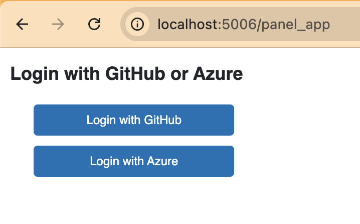
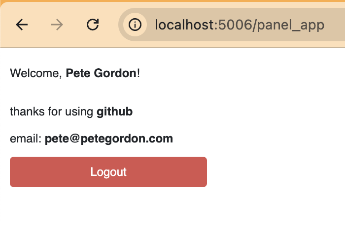

Making fun Panel apps, this one with multiple OAuth is a bit tricky.

You need to register with Github and Azure to get ClientID, ClientSecret, and Azure TenantID.

## Register with Providers

[Github App Registration](https://docs.github.com/en/apps/creating-github-apps/registering-a-github-app/registering-a-github-app)

[Microsoft Azure App Registration](https://learn.microsoft.com/en-us/entra/identity-platform/quickstart-register-app?tabs=certificate)

## Run Application

Run FASTAPI authentication application
```bash
uvicorn auth_server:app --reload --host 0.0.0.0 --port 8000
```

Run Python Panel application
```bash
panel serve panel_app.py --allow-websocket-origin="*"
```



